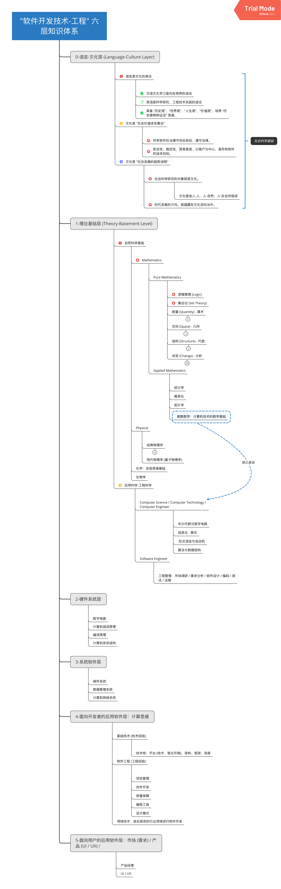
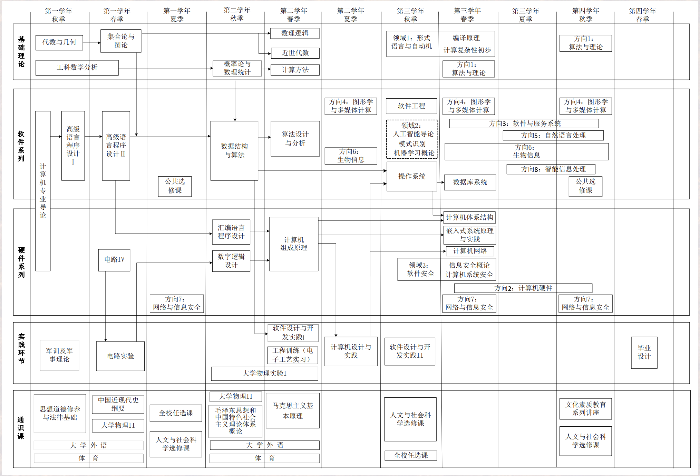

# 软件开发技术知识体系结构  

## "软件开发技术-工程六层知识体系" 概论
> updated 2019-03-11  
> by LYU Shulun  

## 参考资料

### 哈工大计算机本科教育

[计算机类本科生培养方案 (PDF, 1.1 MB)](pdf-files/计算机类本科生培养方案.pdf)  

[软件工程专业本科生培养方案 (PDF, 975 KB)](pdf-files/软件工程专业本科生培养方案.pdf)

  

### 参考网课

* [中国大学 Mooc: 计算机专业导论](https://www.icourse163.org/course/HIT-437006#/info)  

### 参考书籍  

* 大学计算机-计算与信息素养 (第二版). 战德臣. 高等教育出版社  

